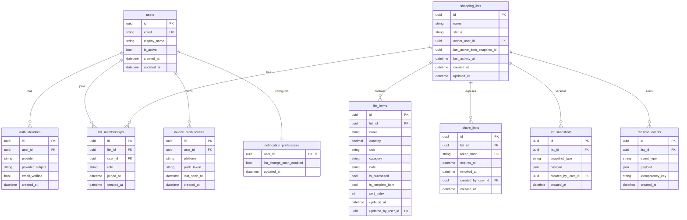

# Feature 007 - Technical Design

## Scope
Technical design for MVP backend using FastAPI + PostgreSQL with realtime collaboration, offline replay compatibility, and explicit API/event contracts.

## Design Principles
- Contract-first backend to reduce frontend rework.
- Simple architecture with clear module boundaries, suitable for one developer.
- Provider-independent core runtime (FastAPI, PostgreSQL, Redis optional only if needed later).
- Deterministic behavior for conflict resolution and offline replay.

## Architecture Overview

### Runtime Components
- API service: FastAPI (REST + WebSocket endpoints)
- Database: PostgreSQL
- Event fan-out: PostgreSQL LISTEN/NOTIFY (MVP)
- Background workers: lightweight internal tasks for cleanup and maintenance

### FastAPI Module Boundaries
- `app/main.py`: bootstrap and wiring
- `app/core/`: config, security, errors, logging
- `app/db/`: SQLAlchemy models, migrations, session
- `app/api/rest/`: versioned REST routers
- `app/api/ws/`: websocket handlers and channel auth
- `app/modules/auth/`: auth domain and use cases
- `app/modules/lists/`: list lifecycle and item operations
- `app/modules/sharing/`: invite links and membership
- `app/modules/templates/`: recurring template semantics
- `app/modules/history/`: snapshots and restore
- `app/modules/realtime/`: event building, publish/subscribe bridge
- `app/modules/notifications/`: push delivery orchestration
- `app/tests/`: contract/integration/realtime tests

## ER Model (MVP)

### Entity Summary
- `users`
- `auth_identities`
- `shopping_lists`
- `list_memberships`
- `list_items`
- `share_links`
- `list_snapshots`
- `realtime_events`
- `notification_preferences`
- `device_push_tokens`

### Core Constraints
- A list must have an owner membership.
- Every item belongs to exactly one list.
- Every mutating operation is validated against membership authorization.
- Share links are list-scoped and revocable.
- Snapshot restore is constrained to the latest restorable snapshot in MVP.

### ER Diagram


## Domain Semantics

### Conflict Resolution
- MVP policy: last-write-wins at item record level.
- `updated_at` and monotonic server write order determine winner.
- Tie-breaker: database commit order.

### Offline Replay Semantics
- Mutating requests accept optional `Idempotency-Key` header.
- Server stores operation result fingerprint for replay window.
- Duplicate key with same payload returns original success response.
- Duplicate key with different payload returns `409` with error code.

### Reset and Restore Semantics
- Reset action creates a `pre_reset` snapshot before mutation.
- Reset sets all recurring/template baseline items to `is_purchased=false`.
- Temporary items can persist or be removed by configured policy (MVP default: keep and uncheck).
- Quick restore restores latest `pre_reset` snapshot only.

## REST Contract Matrix (MVP)

### Auth
- `POST /api/v1/auth/register`
- `POST /api/v1/auth/login`
- `POST /api/v1/auth/oauth/{provider}`
- `POST /api/v1/auth/forgot-password`
- `POST /api/v1/auth/reset-password`
- `POST /api/v1/auth/verify-email`
- `POST /api/v1/auth/logout`

### Lists and Items
- `GET /api/v1/lists`
- `POST /api/v1/lists`
- `GET /api/v1/lists/{list_id}`
- `PATCH /api/v1/lists/{list_id}`
- `DELETE /api/v1/lists/{list_id}`
- `POST /api/v1/lists/{list_id}/items`
- `PATCH /api/v1/lists/{list_id}/items/{item_id}`
- `DELETE /api/v1/lists/{list_id}/items/{item_id}`
- `POST /api/v1/lists/{list_id}/reset`
- `POST /api/v1/lists/{list_id}/restore-latest`

### Sharing and Membership
- `GET /api/v1/lists/{list_id}/members`
- `POST /api/v1/lists/{list_id}/share-links`
- `POST /api/v1/lists/{list_id}/share-links/{share_link_id}/revoke`
- `POST /api/v1/share-links/consume`

### History and Profile
- `GET /api/v1/lists/{list_id}/history`
- `GET /api/v1/profile`
- `PATCH /api/v1/profile`
- `GET /api/v1/profile/notifications`
- `PATCH /api/v1/profile/notifications`
- `POST /api/v1/profile/push-tokens`

## WebSocket Contract (MVP)

### Connection
- `GET /api/v1/ws/lists/{list_id}` with bearer token.
- Authorization required: user must be member of list.

### Event Types
- `list.item.created`
- `list.item.updated`
- `list.item.deleted`
- `list.item.purchased_toggled`
- `list.reset.performed`
- `list.restore.performed`
- `list.member.joined`
- `list.member.left`

### Event Envelope
```json
{
  "event_id": "uuid",
  "event_type": "list.item.updated",
  "list_id": "uuid",
  "occurred_at": "2026-03-21T12:00:00Z",
  "actor_user_id": "uuid",
  "payload": {},
  "version": 1
}
```

## Authorization Matrix
- Owner permissions: full list lifecycle and destructive actions.
- Member permissions (MVP decision): create/update/delete/toggle/reset/restore/list-share actions.
- Non-member: no list access, except valid share-link consume endpoint.

## Error Contract

### Error Shape
```json
{
  "error": {
    "code": "LIST_NOT_FOUND",
    "message": "List not found",
    "details": {},
    "trace_id": "uuid"
  }
}
```

### Standard Error Codes
- `AUTH_INVALID_CREDENTIALS`
- `AUTH_EMAIL_NOT_VERIFIED`
- `AUTH_TOKEN_INVALID`
- `FORBIDDEN_LIST_ACCESS`
- `LIST_NOT_FOUND`
- `ITEM_NOT_FOUND`
- `SHARE_LINK_EXPIRED`
- `SHARE_LINK_REVOKED`
- `IDEMPOTENCY_KEY_REUSED_WITH_DIFFERENT_PAYLOAD`
- `CONFLICT_LAST_WRITE_WINS_SUPERSEDED`
- `VALIDATION_ERROR`
- `INTERNAL_ERROR`

## Security Baseline
- JWT access tokens with short expiry.
- Refresh strategy configurable (phase 4 decision if needed).
- OAuth provider identity linked to internal user record.
- Share links stored as token hash, never plaintext.

## Migration Strategy from Legacy Java
- Legacy Java remains historical and out of MVP runtime.
- New FastAPI modules own all new runtime traffic.
- OpenAPI contracts for Python backend become single source of truth.

## Testing Strategy

### Contract Tests
- Verify REST request/response schemas and error codes.
- Verify WebSocket envelope and event payload schema.

### Integration Tests
- Membership authorization checks.
- Share-link lifecycle behavior.
- Reset and restore semantics.
- Idempotent replay behavior.

### Realtime Tests
- Event fan-out to multiple connected members.
- Ordering and eventual consistency under concurrent updates.

## Critical Risks and Mitigations
- Risk: ambiguous offline replay behavior.
  - Mitigation: mandatory idempotency key contract for queued writes.
- Risk: divergent frontend/backend event semantics.
  - Mitigation: versioned event envelope and contract tests.
- Risk: accidental data loss on reset.
  - Mitigation: enforced pre-reset snapshot transaction.

## Requirement-to-Design Mapping
- FR-backend-01/02 -> domain entities, ER diagram, constraints
- FR-backend-03 -> REST matrix
- FR-backend-04 -> WebSocket contract
- FR-backend-05 -> authorization matrix
- FR-backend-06 -> idempotency and replay semantics
- FR-backend-07 -> reset/restore transaction semantics
- FR-backend-08 -> list item validation and catalog constraints
- FR-backend-09 -> share-link lifecycle design
- FR-backend-10 -> error contract standard
- FR-backend-11 -> module boundaries
- FR-backend-12 -> testing strategy
- NFR-01/02/03 -> architecture simplicity, OSS runtime, traceability
