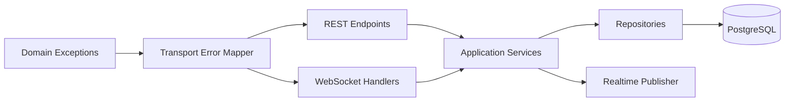
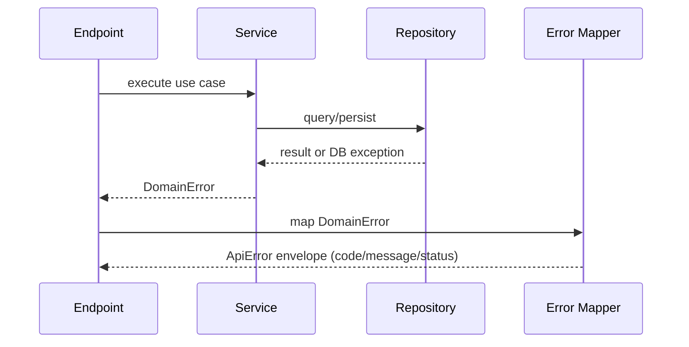
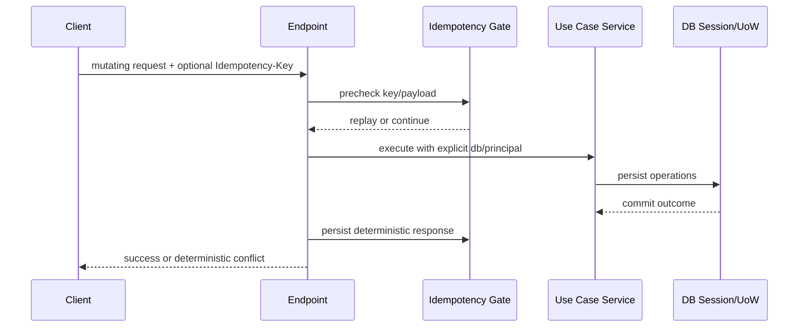
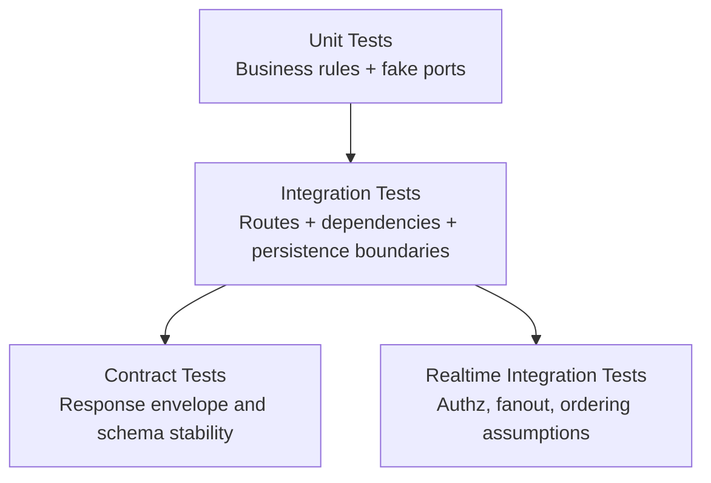

# Feature 008 - Technical Design

## Scope
Technical design for a backend quality overhaul focused on boundaries, error model, repository consistency, transaction model consistency, and test architecture quality.

## Architecture Direction
- Domain/Application layers: raise domain exceptions only.
- Transport layer (REST/WS): maps domain exceptions to transport contracts.
- Repository layer: handles persistence concerns and query composition.
- Service layer: coordinates business rules with explicit dependencies.

## Target Layered Model

## Exception Flow

## Transaction and Idempotency Flow (Target)

## Test Architecture (Target)

## Refactor Slices
1. Exception architecture foundation + auth repository adoption.
2. Service signature explicit dependencies (remove hidden request context).
3. Transaction ownership normalization + idempotency boundary extraction.
4. Test fixture redesign and negative-path coverage expansion.
5. Documentation closure and traceability sync.

## ADR Notes
### ADR-008-01 Exception Taxonomy
- Decision: Use domain exceptions in service/repository flows and map in transport boundary.
- Rationale: Reduces HTTP coupling and improves reuse/testability.

### ADR-008-02 Auth Repository Pattern
- Decision: Introduce `auth/repository.py` and remove direct SQL from auth service/dependencies.
- Rationale: Consistent boundaries and easier query evolution.

### ADR-008-03 Transaction Ownership
- Decision: Prefer explicit service-level/UoW orchestration for multi-step flows.
- Rationale: Avoid mixed commit semantics across layers.

### ADR-008-04 Test Suite Direction
- Decision: Shift from monkeypatch-heavy endpoint tests toward behavior-focused integration tests.
- Rationale: Better confidence and reduced brittleness.

## Security Notes
- Keep authn/authz checks explicit in boundary code.
- Maintain safe error responses (no secrets or stack traces).
- Preserve rate-limit controls and input validation on sensitive endpoints.
